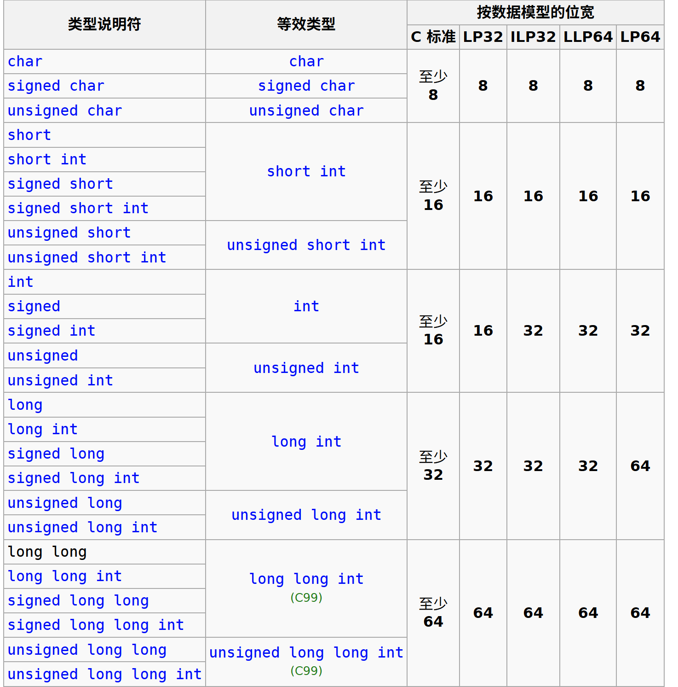
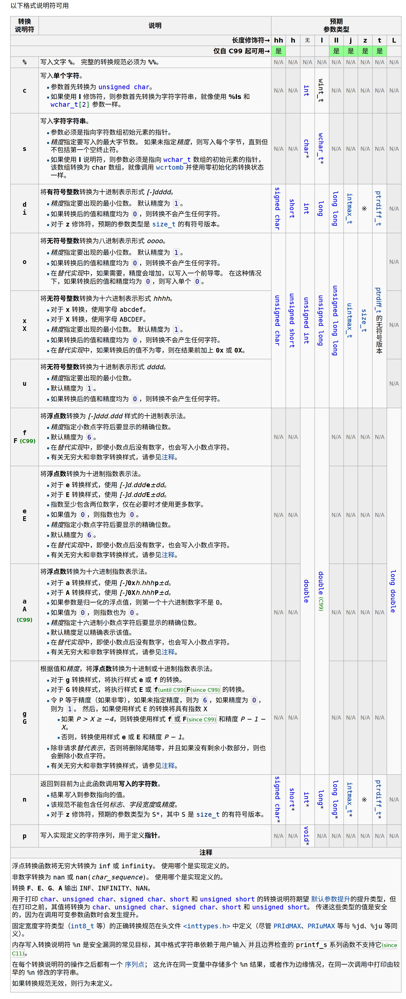
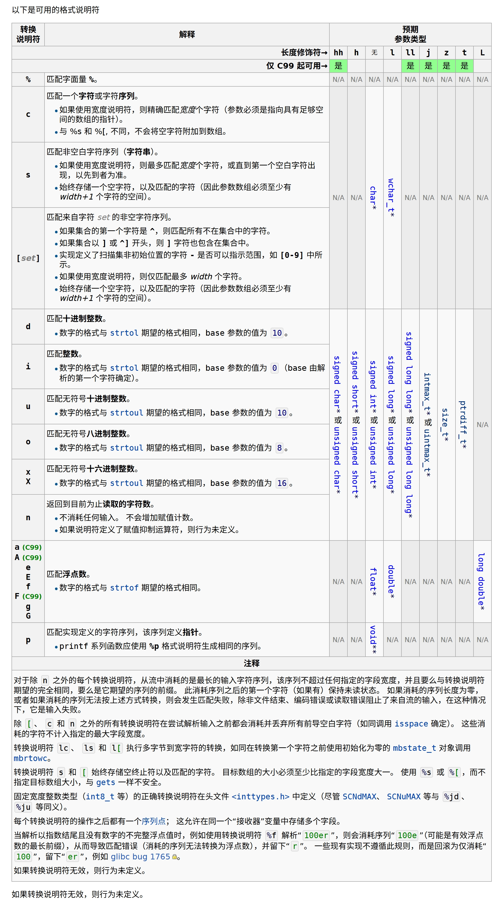

# Class 3

## 1. C中的基本类型

### [声明](https://cppreference.cn/w/c/language/declarations)

```c
说明符和限定符 声明符和初始化器(可选);
```

说明符和限定符为空格分隔的列表，顺序任意，包括：

- 类型说明符
- 零个零个或一个存储类说明符：
  - `extern`
  - `static`
  - `register`
  - `typedef`
  - ...
- 零个或多个类型限定符：
  - `const`
  - `volatile`
  - ...

| 类型说明符                    |
| ----------------------------- |
| void                          |
| 算数类型名                    |
| 原子类型名                    |
| 先前由 typedef 声明引入的名称 |
| struct、union 或 enum 说明符  |

```c
int a, *b=NULL; // "int" is the type specifier,
                // "a" is a declarator
                // "*b" is a declarator and NULL is its initializer
const int *f(void); // "int" is the type specifier
                    // "const" is the type qualifier
                    // "*f(void)" is the declarator
enum COLOR {RED, GREEN, BLUE} c; // "enum COLOR {RED, GREEN, BLUE}" is the type specifier
                                 // "c" is the declarator
```

### [算数类型](https://cppreference.cn/w/c/language/arithmetic_types)



### [运算符优先级](https://cppreference.cn/w/c/language/operator_precedence)

|优先级|运算符|描述|结合性|
|--|--|--|--|
|1|`++` `--`|后缀/后置递增和递减|从左到右|
||`()`|函数调用|||
||`[]`|数组下标|||
||`.`|结构体和联合体成员访问|||
||`->`|通过指针访问结构体和联合体成员|||
||`(type){list}`|复合字面量 **(C99)**|||
|2|`++` `--`|前缀递增和递减[[注1]](https://cppreference.cn/w/c/language/operator_precedence#cite_note-1)|从右到左|
||`+` `-`|一元加和减|||
||`!` `~`|逻辑非和按位非|||
||`(type)`|类型转换|||
||`*`|间接寻址（解引用）|||
||`&`|取地址|||
||`sizeof`|Size-of[[注2]](https://cppreference.cn/w/c/language/operator_precedence#cite_note-2)|||
||`_Alignof`|对齐要求 **(C11)**|||
|3|`*` `/` `%`|乘法、除法和取余|从左到右|
|4|`+` `-`|加法和减法||
|5|`<<` `>>`|按位左移和右移||
|6|`<` `<=`|对于关系运算符<和≤分别||
||`>` `>=`|对于关系运算符>和≥分别|||
|7|`==` `!=`|对于关系运算符=和≠分别||
|8|`&`|按位与||
|9|`^`|按位异或||
|10|`\|`|按位或||
|11|`&&`|逻辑与||
|12|`\|\|`|逻辑或||
|13|`?:`|三元条件[[注3]](https://cppreference.cn/w/c/language/operator_precedence#cite_note-3)|从右到左|
|14[[注4]](https://cppreference.cn/w/c/language/operator_precedence#cite_note-4)|`=`|简单赋值||
||`+=` `-=`|加法和减法赋值|||
||`*=` `/=` `%=`|乘法、除法和取余赋值|||
||`<<=` `>>=`|按位左移和右移赋值|||
||`&=` `^=` `\|=`|按位与、异或和或赋值|||
|15|`,`|逗号|从左到右|

### [隐式转换](https://cppreference.cn/w/c/language/conversion)

### [字符串转义序列](https://cppreference.cn/w/c/language/escape)

| 转义序列 | 描述       |
| -------- | ---------- |
| `\'`   | 单引号     |
| `\"`   | 双引号     |
| `\\`   | 反斜杠     |
| `\?`   | 问号       |
| `\a`   | 响铃       |
| `\b`   | 退格       |
| `\f`   | 换页       |
| `\n`   | 换行       |
| `\r`   | 回车       |
| `\t`   | 水平制表符 |
| `\v`   | 垂直制表符 |
| `\0`   | 空字符     |

### [`printf`](https://cppreference.cn/w/c/io/fprintf)函数、[`scanf`](https://cppreference.cn/w/c/io/fscanf)函数

函数原型：

```c
int printf(const char *format, ...);
int fprintf(FILE *stream, const char *format, ...);
int scanf(const char *format, ...);
int fscanf(FILE *stream, const char *format, ...);
```
#### `printf`函数格式化字符串

#### `scanf`函数格式化字符串

