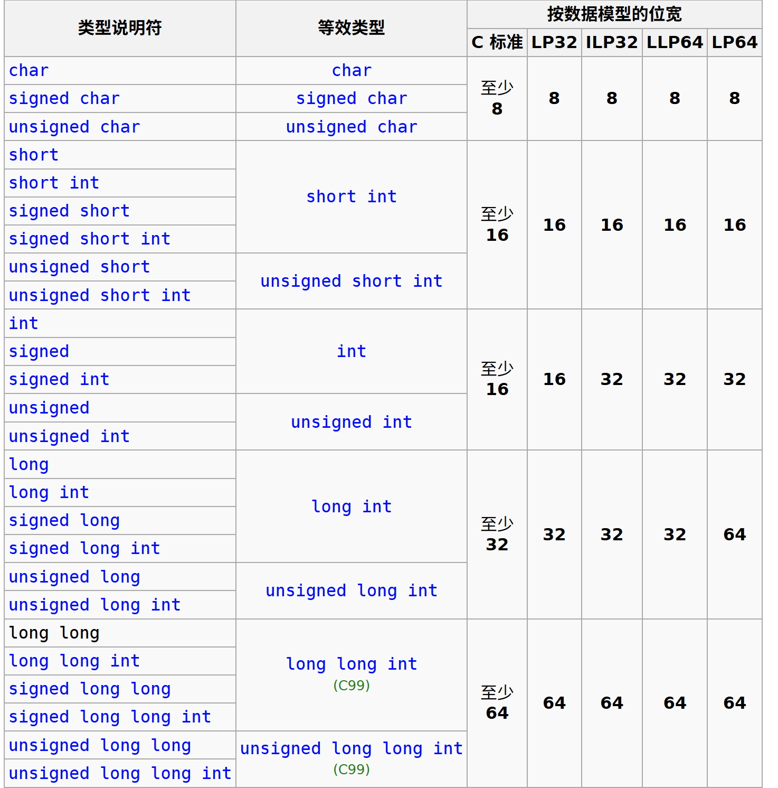
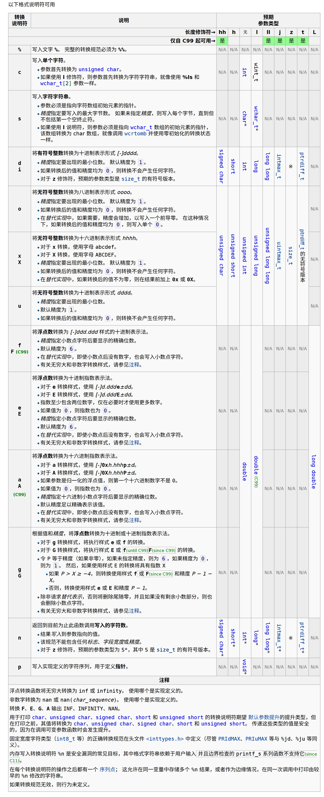
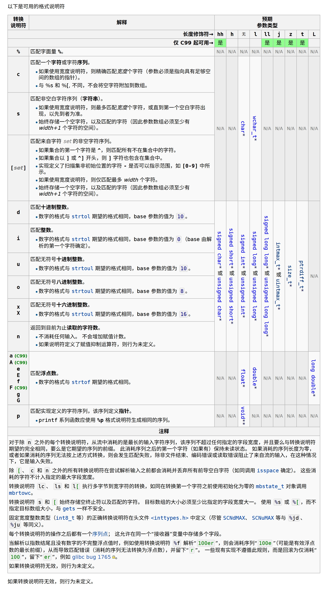
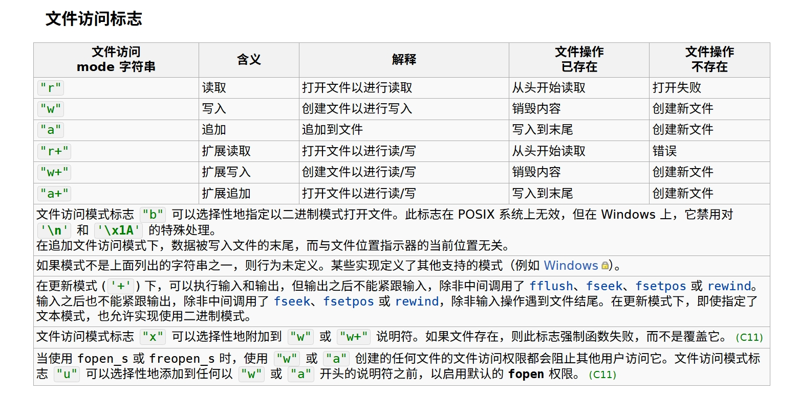

# Class 4

## 1. 分辨中文和英文标点符号

```
// 中文标点符号
；，。？！：“”‘’（）【】《》——……·
// 英文标点符号
;,.?!:"'()[]{}-...`
```
## 2. C中的基本类型

### [声明](https://cppreference.cn/w/c/language/declarations)

```c
说明符和限定符 声明符和初始化器(可选);
```

说明符和限定符为空格分隔的列表，顺序任意，包括：

- 类型说明符
- 零个零个或一个存储类说明符：
  - `extern`
  - `static`
  - `register`
  - `typedef`
  - ...
- 零个或多个类型限定符：
  - `const`
  - `volatile`
  - ...

| 类型说明符                    |
| ----------------------------- |
| void                          |
| 算数类型名                    |
| 原子类型名                    |
| 先前由 typedef 声明引入的名称 |
| struct、union 或 enum 说明符  |

```c
int a, *b=NULL; // "int" is the type specifier,
                // "a" is a declarator
                // "*b" is a declarator and NULL is its initializer
const int *f(void); // "int" is the type specifier
                    // "const" is the type qualifier
                    // "*f(void)" is the declarator
enum COLOR {RED, GREEN, BLUE} c; // "enum COLOR {RED, GREEN, BLUE}" is the type specifier
                                 // "c" is the declarator
```

### [算数类型](https://cppreference.cn/w/c/language/arithmetic_types)



### [<limits.h>](https://cppreference.cn/w/c/header/limits)

```c
#include <limits.h>
#include <stdint.h>
#include <stdio.h>
 
int main(void)
{
    printf("CHAR_BIT       = %d\n", CHAR_BIT);
    printf("MB_LEN_MAX     = %d\n\n", MB_LEN_MAX);
 
    printf("CHAR_MIN       = %+d\n", CHAR_MIN);
    printf("CHAR_MAX       = %+d\n", CHAR_MAX);
    printf("SCHAR_MIN      = %+d\n", SCHAR_MIN);
    printf("SCHAR_MAX      = %+d\n", SCHAR_MAX);
    printf("UCHAR_MAX      = %u\n\n", UCHAR_MAX);
 
    printf("SHRT_MIN       = %+d\n", SHRT_MIN);
    printf("SHRT_MAX       = %+d\n", SHRT_MAX);
    printf("USHRT_MAX      = %u\n\n", USHRT_MAX);
 
    printf("INT_MIN        = %+d\n", INT_MIN);
    printf("INT_MAX        = %+d\n", INT_MAX);
    printf("UINT_MAX       = %u\n\n", UINT_MAX);
 
    printf("LONG_MIN       = %+ld\n", LONG_MIN);
    printf("LONG_MAX       = %+ld\n", LONG_MAX);
    printf("ULONG_MAX      = %lu\n\n", ULONG_MAX);
 
    printf("LLONG_MIN      = %+lld\n", LLONG_MIN);
    printf("LLONG_MAX      = %+lld\n", LLONG_MAX);
    printf("ULLONG_MAX     = %llu\n\n", ULLONG_MAX);
 
    printf("PTRDIFF_MIN    = %td\n", PTRDIFF_MIN);
    printf("PTRDIFF_MAX    = %+td\n", PTRDIFF_MAX);
    printf("SIZE_MAX       = %zu\n", SIZE_MAX);
    printf("SIG_ATOMIC_MIN = %+jd\n",(intmax_t)SIG_ATOMIC_MIN);
    printf("SIG_ATOMIC_MAX = %+jd\n",(intmax_t)SIG_ATOMIC_MAX);
    printf("WCHAR_MIN      = %+jd\n",(intmax_t)WCHAR_MIN);
    printf("WCHAR_MAX      = %+jd\n",(intmax_t)WCHAR_MAX);
    printf("WINT_MIN       = %jd\n", (intmax_t)WINT_MIN);
    printf("WINT_MAX       = %jd\n", (intmax_t)WINT_MAX);
}
```

output:

```sh
CHAR_BIT       = 8
MB_LEN_MAX     = 5

CHAR_MIN       = -128
CHAR_MAX       = +127
SCHAR_MIN      = -128
SCHAR_MAX      = +127
UCHAR_MAX      = 255

SHRT_MIN       = -32768
SHRT_MAX       = +32767
USHRT_MAX      = 65535

INT_MIN        = -2147483648
INT_MAX        = +2147483647
UINT_MAX       = 4294967295

LONG_MIN       = -2147483648
LONG_MAX       = +2147483647
ULONG_MAX      = 4294967295

LLONG_MIN      = -9223372036854775808
LLONG_MAX      = +9223372036854775807
ULLONG_MAX     = 18446744073709551615

PTRDIFF_MIN    = -9223372036854775808
PTRDIFF_MAX    = +9223372036854775807
SIZE_MAX       = 18446744073709551615
SIG_ATOMIC_MIN = -2147483648
SIG_ATOMIC_MAX = +2147483647
WCHAR_MIN      = +0
WCHAR_MAX      = +65535
WINT_MIN       = 0
WINT_MAX       = 65535
```

### [隐式转换](https://cppreference.cn/w/c/language/conversion)

## 3. [运算符优先级](https://cppreference.cn/w/c/language/operator_precedence)

|优先级|运算符|描述|结合性|
|--|--|--|--|
|1|`++` `--`|后缀/后置递增和递减|从左到右|
||`()`|函数调用|||
||`[]`|数组下标|||
||`.`|结构体和联合体成员访问|||
||`->`|通过指针访问结构体和联合体成员|||
||`(type){list}`|复合字面量 **(C99)**|||
|2|`++` `--`|前缀递增和递减[[注1]](https://cppreference.cn/w/c/language/operator_precedence#cite_note-1)|从右到左|
||`+` `-`|一元加和减|||
||`!` `~`|逻辑非和按位非|||
||`(type)`|类型转换|||
||`*`|间接寻址（解引用）|||
||`&`|取地址|||
||`sizeof`|Size-of[[注2]](https://cppreference.cn/w/c/language/operator_precedence#cite_note-2)|||
||`_Alignof`|对齐要求 **(C11)**|||
|3|`*` `/` `%`|乘法、除法和取余|从左到右|
|4|`+` `-`|加法和减法||
|5|`<<` `>>`|按位左移和右移||
|6|`<` `<=`|对于关系运算符<和≤分别||
||`>` `>=`|对于关系运算符>和≥分别|||
|7|`==` `!=`|对于关系运算符=和≠分别||
|8|`&`|按位与||
|9|`^`|按位异或||
|10|`\|`|按位或||
|11|`&&`|逻辑与||
|12|`\|\|`|逻辑或||
|13|`?:`|三元条件[[注3]](https://cppreference.cn/w/c/language/operator_precedence#cite_note-3)|从右到左|
|14[[注4]](https://cppreference.cn/w/c/language/operator_precedence#cite_note-4)|`=`|简单赋值||
||`+=` `-=`|加法和减法赋值|||
||`*=` `/=` `%=`|乘法、除法和取余赋值|||
||`<<=` `>>=`|按位左移和右移赋值|||
||`&=` `^=` `\|=`|按位与、异或和或赋值|||
|15|`,`|逗号|从左到右|

### [与、或、异或、非运算真值表](https://blog.csdn.net/weixin_52487896/article/details/125889966)
|`A`|`B`|`A & B`|`A \| B`|`A ^ B`|`!A`(运算符`~`)|
|---|---|-------|-------|-------|-----|
| 0 | 0 |   0   |   0   |   0   |  1  |
| 0 | 1 |   0   |   1   |   1   |  1  |
| 1 | 0 |   0   |   1   |   1   |  0  |
| 1 | 1 |   1   |   1   |   0   |  0  |

### 自增、自减运算符
- `++`：自增运算符，将变量的值增加1。
- `--`：自减运算符，将变量的值减少1。
- 前缀形式：`++a` 或 `--a`，先自增或自减，然后使用变量的值，即先改变变量的值，再返回变量的值。
- 后缀形式：`a++` 或 `a--`，先使用变量的值，然后自增或自减，即先返回变量的值，再改变变量的值。

### [sizeof](https://cppreference.cn/w/c/language/sizeof)
- `sizeof` 是一个运算符，用于获取数据类型或变量所占的字节数。
- 语法：`sizeof(type)` 或 `sizeof expression`。

## 4. 字符串
### [字符串转义序列](https://cppreference.cn/w/c/language/escape)

| 转义序列 | 描述       |
| -------- | ---------- |
| `\'`   | 单引号     |
| `\"`   | 双引号     |
| `\\`   | 反斜杠     |
| `\?`   | 问号       |
| `\a`   | 响铃       |
| `\b`   | 退格       |
| `\f`   | 换页       |
| `\n`   | 换行       |
| `\r`   | 回车       |
| `\t`   | 水平制表符 |
| `\v`   | 垂直制表符 |
| `\0`   | 空字符     |

### [`printf`](https://cppreference.cn/w/c/io/fprintf)函数、[`scanf`](https://cppreference.cn/w/c/io/fscanf)函数

函数原型：

```c
int printf(const char *format, .../*value*/);
int fprintf(FILE *stream, const char *format, .../*value*/);
int scanf(const char *format, .../*pointer*/);
int fscanf(FILE *stream, const char *format, .../*pointer*/);
```
#### `printf`函数格式化字符串

#### `scanf`函数格式化字符串


## 5. 分支、循环
### [`if`](https://cppreference.cn/w/c/language/if)、[`switch`](https://cppreference.cn/w/c/language/switch)
```c
if (condition) {
    // 条件为真时执行的代码
} 
else if (another_condition) {
    // 另一个条件为真时执行的代码
} 
else {
    // 所有条件都不满足时执行的代码
}
//括号内代码若为单行可省略大括号，但不建议
//且 else 始终与最接近的 if 相关联
if(condition)
    // 条件为真时执行的代码
else 
    // 条件为假时执行的代码

// 错误示范：
if (condition_1)
    // ...
  if (condition_2)
      // ...
else
    // ...
```
#### `if` 变体：三元运算符
```c
condition ? expression_if_true : expression_if_false;
```
```c
switch (expression) {
    case constant_1:
        // 当 expression 等于 constant_1 时执行的代码
        break; // 可选，跳出 switch 语句
    case constant_2:
        // 当 expression 等于 constant_2 时执行的代码
        break; // 可选，跳出 switch 语句
    default:
        // 当没有匹配的 case 时执行的代码
}
// 若无 break 则会继续执行下一个 case 的代码，直到遇到 break 或 switch 结束
// 作业做过，应该都会注意
```
### [`for`](https://cppreference.cn/w/c/language/for)、[`while`](https://cppreference.cn/w/c/language/while)、[`do while`](https://cppreference.cn/w/c/language/do_while)
```c
for (initialization; condition; increment) {
    // 循环体代码
}
```
```c
while (condition) {
    // 循环体代码
}
```
```c
do {
    // 循环体代码
} while (condition);
```
### [`continue`](https://cppreference.cn/w/c/language/continue)、[`break`](https://cppreference.cn/w/c/language/break)
```c
continue; // 跳过当前循环的剩余部分，进入下一次循环
break; // 跳出当前循环或 switch 语句
```
### [`goto`](https://cppreference.cn/w/c/language/goto)、[`return`](https://cppreference.cn/w/c/language/return)
```c
goto label; // 跳转到指定标签处，基本不用，应该也不做要求？
return expression; // 从函数返回，表达式的值将作为函数的返回值
```

## 6. [数组](https://cppreference.cn/w/c/language/array)
下标从0开始，数组的大小必须是正整数，且不能为0。
### 不建议使用可变长数组（VLA），教材默认该写法不可通过编译，虽然部分编译器可以通过编译
### 字符串数组的赋值
```c
char str1[] = "Hello"; // 正确，字符串字面量会被复制
char str2[6] = "Hello"; // 正确，数组大小足够容纳字符串和终止符
char str3[5] = "Hello"; // 错误，数组大小不足以容纳字符串和终止符
char str4[6];
str4 = "Hello"; // 错误，不能将字符串字面量直接赋值给数组
str4[0] = 'H'; // 正确，可以逐个字符赋值
for (int i = 0; i < 5; i++) {
    str4[i] = "Hello"[i]; // 正确，可以逐个字符赋值
}
strcpy(str4, "Hello"); // 正确，使用 strcpy 函数复制字符串
```
### <string.h> 中的字符串函数
```c
#include <string.h>
char str1[20] = "Hello";
char str2[20] = "World";
strcat(str1, str2); // 连接字符串，str1 变为 "HelloWorld"
strcpy(str1, str2); // 复制字符串，str1 变为 "World"
int len = strlen(str1); // 获取字符串长度，不包括终止符
int cmp = strcmp(str1, str2); // 比较字符串，返回值小于0表示 str1 小于 str2，等于0表示相等，大于0表示 str1 大于 str2
char *find = strchr(str1, 'o'); // 查找字符 'o' 在 str1 中第一次出现的位置，返回指向该字符的指针，如果未找到则返回 NULL
char *find_last = strrchr(str1, 'o'); // 查找字符 'o' 在 str1 中最后一次出现的位置，返回指向该字符的指针，如果未找到则返回 NULL
```

## 7. [函数](https://cppreference.cn/w/c/language/functions)
### 函数的[声明](https://cppreference.cn/w/c/language/function_declaration)和[定义](https://cppreference.cn/w/c/language/function_definition)
```c
// 函数声明
return_type function_name(parameter_list); // 函数声明，通常放在头文件或源文件的开头
// 函数定义
return_type function_name(parameter_list) {
    // 函数体
    return value; // 可选，返回值
}
```
### 形参与实参
函数的形参（parameter）是函数定义时定义的变量，函数的实参（argument）是调用函数时传入的实际值。

函数的声明格式：

```c
return_type function_name(parameter_list);
```

1. `return_type`：表示函数的返回值的数据类型。
2. `function_name`：表示函数的名称。
3. `parameter_list`：表示函数的形参列表，形参之间用逗号分隔。

   形参列表的每个元素的格式：

   ```c
   type parameter_name
   ```
1. `type`：表示变量的数据类型。
2. `parameter_name`：表示变量的名称。

函数的调用格式：

```c
function_name(argument1, argument2,..., argumentn);
```

1. `function_name`：表示函数的名称。
2. `argument1, argument2,..., argumentn`：表示函数调用时传入的实际值。

实例：

```c
#include <stdio.h>
void print_info(char *name, int age){
    printf("Name: %s, Age: %d\n", name, age);
}
int main(){
    print_info("Tom", 20);
    // 输出结果：Name: Tom, Age: 20
    return 0;
}
```

name和age是函数print_info的形参，"Tom"和20是函数print_info的实参。

### `static` 局部变量
```c
#include <stdio.h>
void function() {
    static int count = 0; // 静态局部变量
    count++;
    printf("Function called %d times\n", count);
}
int main() {
    function(); // 输出：Function called 1 times
    function(); // 输出：Function called 2 times
    return 0;
}
```
### 作业里出现过的函数
#### 折半查找
```c
#include <stdio.h>
int binary_search(int arr[], int size, int target) {
    int left = 0;
    int right = size - 1;

    while (left <= right) {
        int mid = left + (right - left) / 2;

        if (arr[mid] == target) {
            return mid; // 找到目标元素，返回索引
        } else if (arr[mid] < target) {
            left = mid + 1; // 在右半部分继续查找
        } else {
            right = mid - 1; // 在左半部分继续查找
        }
    }
    return -1; // 未找到目标元素
}
int main() {
    int arr[] = {1, 2, 3, 4, 5, 6, 7, 8, 9};
    int size = sizeof(arr) / sizeof(arr[0]);
    int target = 5;

    int result = binary_search(arr, size, target);
    if (result != -1) {
        printf("Element found at index: %d\n", result);
    } else {
        printf("Element not found\n");
    }
    return 0;
}
```
#### [递归函数](../Codes/Functions/Recursion_Functions.md)
```c
#include <stdio.h>
int factorial(int n) {
    if (n == 0 || n == 1) {
        return 1; // 基本情况
    } else {
        return n * factorial(n - 1); // 递归调用
    }
}
int fibonacci(int n) {
    if (n == 0) {
        return 0; // 基本情况
    } else if (n == 1) {
        return 1; // 基本情况
    } else {
        return fibonacci(n - 1) + fibonacci(n - 2); // 递归调用
    }
}
int main() {
    int num = 5;
    int result = factorial(num);
    printf("Factorial of %d is: %d\n", num, result);
    int fib_num = 6;
    int fib_result = fibonacci(fib_num);
    printf("Fibonacci of %d is: %d\n", fib_num, fib_result);
    return 0;
}
```
#### [排序函数](../Codes/Functions/Sort_Functions.md)
```c
#include <stdio.h>
void bubble_sort(int arr[], int size) {
    for (int i = 0; i < size - 1; i++) {
        for (int j = 0; j < size - i - 1; j++) {
            if (arr[j] > arr[j + 1]) {
                // 交换 arr[j] 和 arr[j + 1]
                int temp = arr[j];
                arr[j] = arr[j + 1];
                arr[j + 1] = temp;
            }
        }
    }
}
```

## 8. [指针](https://cppreference.cn/w/c/language/pointer)
```c
float *p, **pp; // p is a pointer to float
                // pp is a pointer to a pointer to float
int (*fp)(int); // fp is a pointer to function with type int(int)
```
指针保存的是内存地址，内存地址可以通过`&`运算符获取，内存可通过`malloc` `calloc` `realloc` `free`等函数动态分配和释放。
指针之间相互赋值的意义为更改指针指向的内存地址，即改变指针指向的变量。
```c
#include <stdio.h>
int main() {
    int a = 10;
    int b = 30;
    int *p = &a; // p指向a的地址
    int *p2 = &b; // p2指向b的地址
    printf("Value of a: %d\n", *p); // 输出a的值
    printf("Value of b: %d\n", *p2); // 输出b的值
    *p = 20; // 修改p指向的值，即修改a的值
    printf("New value of a: %d\n", a); // 输出修改后的a的值
    p = p2; // p现在指向b的地址
    *p = 40; // 修改p指向的值，即修改b的值
    printf("Value of b: %d\n", *p); // 输出b的值
    return 0;
}
```
### 动态分配内存：
```c
#include <stdio.h>
#include <stdlib.h>
int main() {
    int *arr = (int *)malloc(5 * sizeof(int)); // 动态分配5个整数的内存
    if (arr == NULL) {
        printf("Memory allocation failed\n");
        return 1; // 分配失败，退出程序
    }
    for (int i = 0; i < 5; i++) {
        arr[i] = i + 1; // 初始化数组
    }
    for (int i = 0; i < 5; i++) {
        printf("%d ", arr[i]); // 输出数组元素
    }
    printf("\n");
    arr = (int *)realloc(arr, 10 * sizeof(int)); // 扩展数组大小到10个整数
    if (arr == NULL) {
        printf("Memory reallocation failed\n");
        return 1; // 扩展失败，退出程序
    }
    for (int i = 5; i < 10; i++) {
        arr[i] = i + 1; // 初始化新元素
    }
    for (int i = 0; i < 10; i++) {
        printf("%d ", arr[i]); // 输出扩展后的数组元素
    }
    printf("\n");
    free(arr); // 释放动态分配的内存
    return 0;
}
```
### 指针运算
指针运算是指对指针进行加减操作，主要用于数组和指针的遍历。

```c
#include <stdio.h>
int main() {
    int arr[] = {1, 2, 3, 4, 5};
    int *p = arr; // p指向数组的第一个元素
    for (int i = 0; i < 5; i++) {
        printf("%d ", *(p + i)); // 使用指针运算访问数组元素
    }
    printf("\n");
    return 0;
}
```
### [字符串处理函数](../Codes/Functions/String_Functions.md)
## 9. [结构体](https://cppreference.cn/w/c/language/struct)
### [typedef语法](https://cppreference.cn/w/c/language/typedef)：
```c
typedef type name; // 将type类型重命名为name
```
### 结构体声明
```c
struct StructName {
    type member1;
    type member2;
    // ...
};//结构体定义完成后需要添加分号
//普通定义方式，使用方式为struct StructName var;

// 或者使用typedef创建匿名结构体，并将其命名为StructName，使用方式为StructName var;
typedef struct {
    type member1;
    type member2;
    // ...
} StructName; 
```
### [链表操作函数](../Codes/Functions/List_Functions.md)
## 10. [文件操作](https://cppreference.cn/w/c/io)
### [文件的打开和关闭](https://cppreference.com/w/c/io/fopen)
```c
FILE *file = fopen("filename.txt", "r"); // 打开文件，"r"表示以只读模式打开
if (file == NULL) {
    perror("Error opening file"); // 打开失败，输出错误信息
} else {
    // 文件操作代码
    fclose(file); // 关闭文件
}
```
### 相关函数及对应函数原型：
|函数名 | 函数原型 |
|-------|----------|
|[`fopen`](https://cppreference.cn/w/c/io/fopen) | `FILE *fopen(const char *filename, const char *mode);` |
|[`fclose`](https://cppreference.cn/w/c/io/fclose) | `int fclose(FILE *stream);` |
|[`fread`](https://cppreference.cn/w/c/io/fread) | `size_t fread(void *ptr, size_t size, size_t count, FILE *stream);` |
|[`fwrite`](https://cppreference.cn/w/c/io/fwrite) | `size_t fwrite(const void *ptr, size_t size, size_t count, FILE *stream);` |
|[`fgetc`](https://cppreference.cn/w/c/io/fgetc) | `int fgetc(FILE *stream);` |
|[`fputc`](https://cppreference.cn/w/c/io/fputc) | `int fputc(int char, FILE *stream);` |
|[`fgets`](https://cppreference.cn/w/c/io/fgets) | `char *fgets(char *str, int num, FILE *stream);` |
|[`fputs`](https://cppreference.cn/w/c/io/fputs) | `int fputs(const char *str, FILE *stream);` |
|[`fprintf`](https://cppreference.cn/w/c/io/fprintf) | `int fprintf(FILE *stream, const char *format, ...);` |
|[`fscanf`](https://cppreference.cn/w/c/io/fscanf) | `int fscanf(FILE *stream, const char *format, ...);` |
|[`feof`](https://cppreference.cn/w/c/io/feof) | `int feof(FILE *stream);` |

### 打开文件访问模式标识：

### [实例1](../Codes/Usage_Examples/File_Operations.c)、[实例2](../Codes/Usage_Examples/File_Operations_2.c)、[实例3](../Codes/Usage_Examples/Binanry_file_read_and_write.c)
